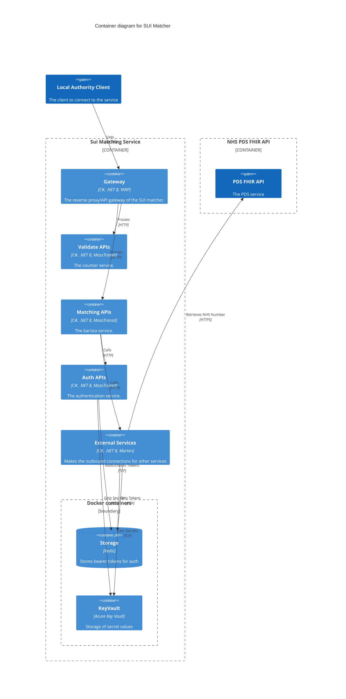

# CSC_Single_Unique_Identifier

Repo for the Single Unique Identifier team which is currently looking at testing the ability to match a persons records to the NHS number in order to understand if this could be implemented as a single unique identifier for children in the future.

Pre-reqs
https://learn.microsoft.com/en-us/dotnet/aspire/fundamentals/setup-tooling?tabs=linux&pivots=dotnet-cli

Install .net SDK v9. Instructions for MacOS below.

```curl -sSL https://dot.net/v1/dotnet-install.sh | bash -s -- --version 9.0.102 --install-dir "$HOME/.dotnet
echo 'export PATH="$HOME/.dotnet:$PATH"' >> ~/.zshrc && source ~/.zshrc && echo $PATH
```

To build and run the project:
```
dotnet build sui-matching.sln
dotnet run --project app-host/AppHost.csproj
```
Run simple test:
```
curl -vv http://localhost:5000/validate/api/v1/runvalidation
```
If you have errors connecting to the aspire host page you may need to run the below commands:
```
dotnet dev-certs https --clean
dotnet dev-certs https --trust
```

### Unit and integration testing

#### Prerequisites

Now running using the environmental files. All non secret material is located in the environment appsettings file. By default all external connectivity is stubbed out. If you want to use the NHS integration environment you will need to set a private key.

- Create `.env` file in the project root (this is necessary to use the stub secrets manager, like Azure KeyVault)

Add the following to the .env file and add in the secret values inside the quotes. Make sure the private key is in the PKCS#1 format. if it is in PKCS#8 you can change it with openssl

```properties
export NhsAuthConfig__NHS_DIGITAL_PRIVATE_KEY=""

export NhsAuthConfig__NHS_DIGITAL_CLIENT_ID=""
```
To change your key into correct format:
```
openssl rsa -in originalkey.pem -traditional -out newkey.pem
```
Then run the command (mac):
```
source .env
```
The 

#### Running

- To run the whole test suite via the terminal:

```
dotnet test --settings tests.runsettings
```

or individually:

```
cd sui-tests
dotnet test <path>/<to>/<test-class>
```

## Container diagram - C4 Model



## Services:

### validate (external):
endpoint used to validate data send to the endpoint. Will return information about the validatity of the data sent to it. Should validate for the following data items:
given name (required)
family name (required)
gender
postcode
date of birth - which can be a range (required)
email address
phone number

Adapted from the schema specified here:
https://digital.nhs.uk/developer/api-catalogue/personal-demographics-service-fhir#get-/Patient

### matching (external):
Supplied with the information also supplied to the validate endpoint. It controls the logic for matching a single record. It crafts the request parameters to pass to the external api service in order to make the outbound call to the NHS.

### auth (internal):
Handles the secret key material in order to get the bearer token. It will maake its outbound connections via the external API. It will use azure keyvault to get the material needed to retrieve the bearer token. It will then store the bearer token in redis to be accessed by the external service.

Examples of how to build - https://github.com/NHSDigital/hello-world-auth-examples/tree/main/application-restricted-signed-jwt-tutorials/csharp

### external (internal):
Makes the external calls to the NHS authentication and NHS PDS endpoints. Will get secerts from keyvault and bearer token from Redis.

https://docs.fire.ly/projects/Firely-NET-SDK/en/latest/client/setup.html - should be implemented using this library.

### keyvault stub (local):
Currently a skeleton container in order to mimic azure keyvault in local testing. Unfortunately aspire does not provide an emulator for keyvault.

## Current Status of Repo
Scaffolding of services built out with an attempt to tie them together.
