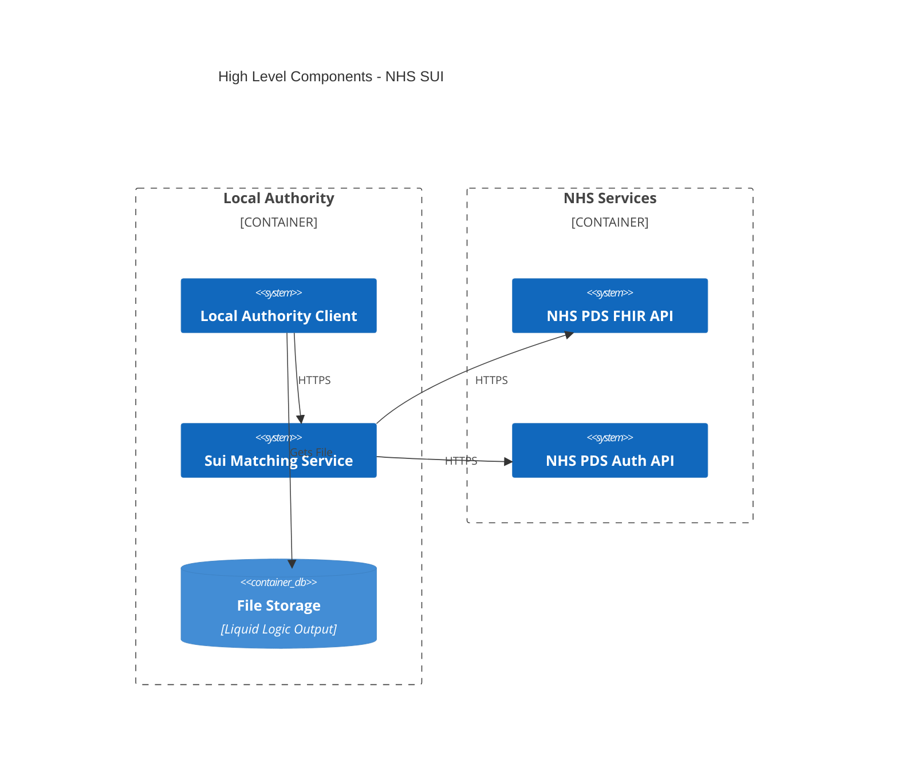
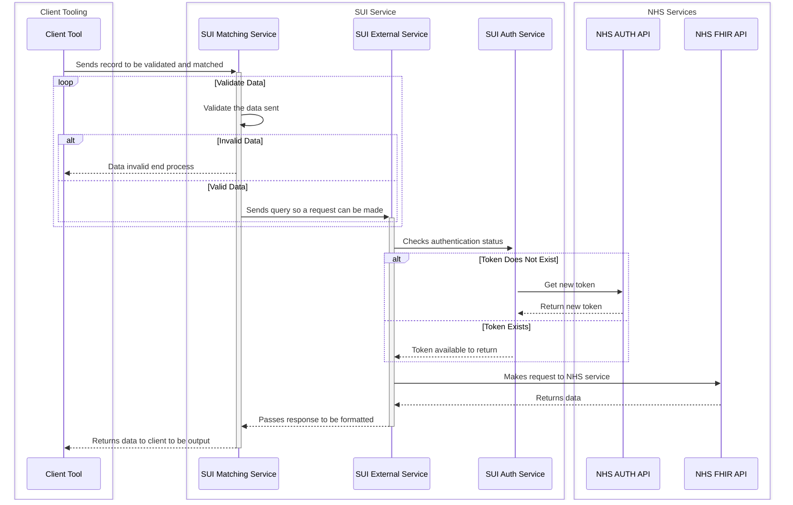
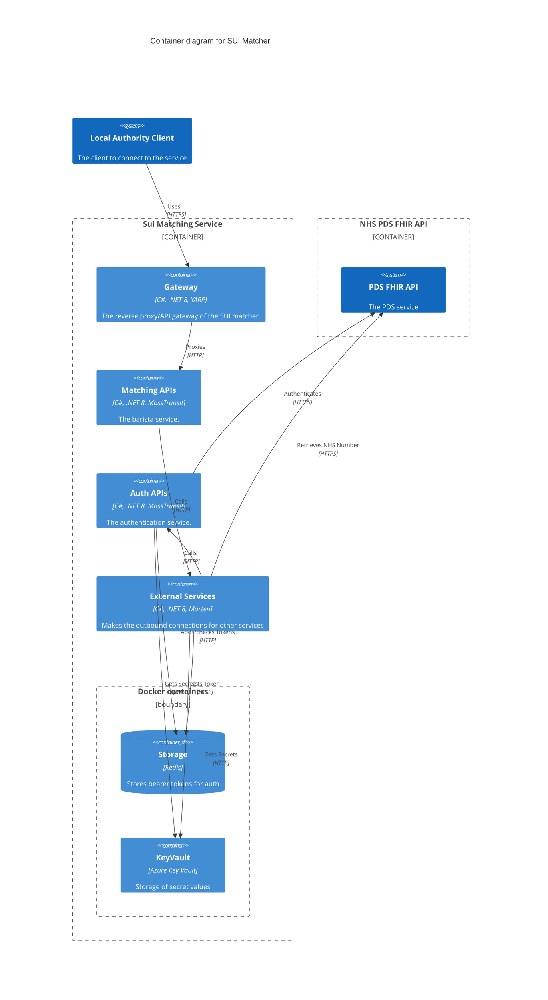
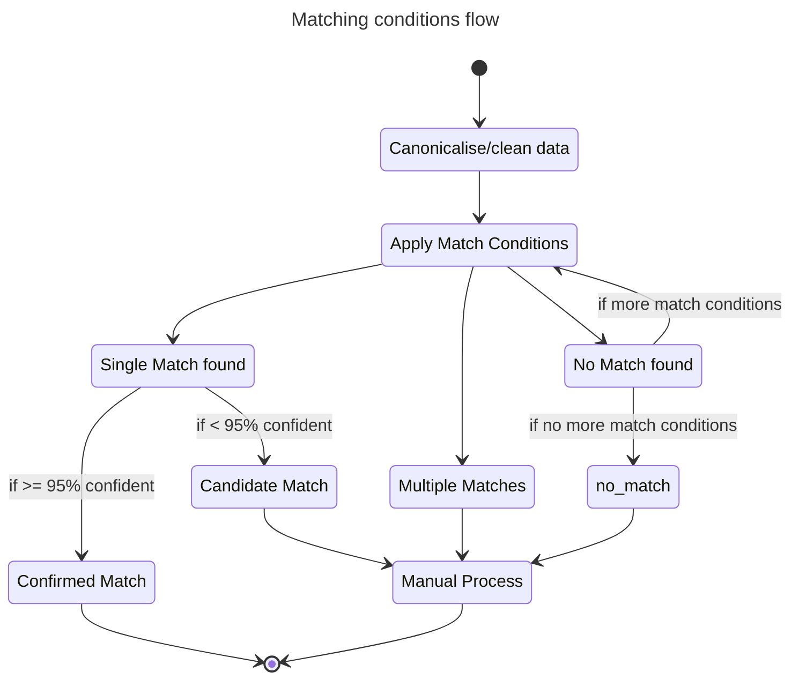

# Architecture

<!--toc:start-->

- [Architecture](#architecture)
  - [Constraints and Principals](#constraints-and-principals)
  - [High Level Logical Architecture](#high-level-logical-architecture)
  - [Systems Architecture](#systems-architecture)
    - [Physical View](#physical-view)
      - [Definitions](#definitions)
      - [Step by Step Flow Happy Path](#step-by-step-flow-happy-path)
    - [Sequence Diagram](#sequence-diagram)
  - [Application Architecture](#application-architecture)
    - [Container diagram](#container-diagram)
    - [Services](#services)
      - [matching](#matching)
      - [auth](#auth)
      - [external](#external)
    - [Search Criteria](#search-criteria)
    - [Search Rules](#search-rules)
      - [Strategy 1 (Default and stable)](#strategy-1-default-and-stable)
      - [Strategy 2](#strategy-2)
      - [Strategy 3](#strategy-3)
  - [Data Overview](#data-overview)
  - [Non Functional Requirements](#non-functional-requirements)
  - [Non Functional Priorities](#non-functional-priorities)

<!--toc:end-->

These are the architecture documents.

## Constraints and Principals

This project is aimed at providing a solution for Local Authorities that require more accurate matching capabilities.

It requires a use-case to be agreed with NHS England to allow the use of the PDS FHIR API. This will require a number of
governance steps to be followed, such as
the [DTAC](https://transform.england.nhs.uk/key-tools-and-info/digital-technology-assessment-criteria-dtac/).

The PDS FHIR API has a limitation of 5 transactions per second for requests, and the "fallback" logic used in the pilot
means each match to a person may use greater than 1 request. This means the PDS FHIR API is expected to initially be the
biggest bottleneck for performance.

For principles, please refer to
the [DfE Technical Guidance](https://technical-guidance.education.gov.uk/principles/general/)
and [Secure by Design Principles](https://www.security.gov.uk/policy-and-guidance/secure-by-design/).

## High Level Logical Architecture



## Systems Architecture

### Physical View


#### Definitions

**Liquid Logic Server (Local Authority owned and run):**
Case management system used for recording referrals. Contains records with demographic information about referrals.

**File Storage (Local Authority owned and run):**
Server that will contain the file with the source information.

**Client Tool (New Component):**
A tool that takes the input file from the file storage and loops through the rows of data making a request to the SUI
matching service. It outputs a results of the matching process and extra information about it.

**SUI Resource Group (New Component):**
Represents the application that will be deployed in a Local Authority.

#### Step by Step Flow Happy Path

1. A nightly batch job runs that outputs a CSV file to an accessible location.
2. The client tool periodically checks for a new file.
3. When a new file is present it consumes it and starts to process the data.
4. The client loops through the records in the file and extracts the information needed to be able to make an API call
   against the SUI Matching Service via a private endpoint.
5. The SUI Matching Service ingress controller (reverse proxy) accepts the request and forwards it onto the service.
6. The SUI Service validates the data.
7. With valid data it then checks authentication is in place to make a request to the NHS.
8. With valid data and a valid authentication token it then makes one or more calls to the NHS PDS FHIR API to retrieve
   a NHS number. This call is made over the internet.
9. The returned results are examined and then returned to the client.
10. The client outputs the data to a results CSV file (NHS numbers alongside the data) and a metadata CSV file that
    gives further information on the process and input data.

### Sequence Diagram



## Application Architecture

### Container diagram



### Services

#### matching

The matching service provides the ingress into the application. It also serves as the logic controller for the
application. It accepts the following parameters:

- given name (required)
- family name (required)
- date of birth - which can be a range (required)
- gender
- postcode
- email address
- phone number

Adapted from the schema specified here
[NHS PDS FHIR Schema](https://digital.nhs.uk/developer/api-catalogue/personal-demographics-service-fhir#get-/Patient).

It validates these parameters meet the schema and then handles the logic for making external calls to the NHS in order
to find a matching NHS number.

Response 200:

``` json
{ 
    "result": {
        "matchStatus": "match",
        "nhsNumber": "1234567890",
        "processStage": "3",
        "score": "0.96"
    },
    "dataQuality": {
        "given": "valid",
        "family": "valid",
        "birthdate": "valid",
        "addressPostalCode": "valid",
        "phone": "invalid",
        "email": "invalid",
        "gender": "notProvided"
    }
}
```

Result

| Name         | Type   | Desc                              | Values                                    |
|:-------------|:-------|:----------------------------------|:------------------------------------------|
| matchStatus  | string | Match Result                      | match, noMatch, potentialMatch, manyMatch |
| nhsNumber    | string | nhsNumnber                        | 10 digit string, empty string             |
| ProcessStage | int    | stage of the process it exited at | 0, 1, 2, 3                                |
| score        | number | Score of the search               | 0.0 to 1.0                                |

**Match Status**

| Name           | Desc                                                                       |
|:---------------|:---------------------------------------------------------------------------|  
| match          | One match has been returned                                                |
| noMatch        | No match has been returned                                                 |
| potentialMatch | There is a potential match. One match with score above 0.85 and below 0.95 |
| manyMatch      | System returns mulitple matches                                            |

**Data quality**

| Return      | Type   | Desc                     |
|:------------|:-------|:-------------------------|  
| Valid       | string | Data provided is valid   |
| Invalid     | string | Data provided is invalid |
| notProvided | string | No data was provided     |

#### auth

Handles the secret key material in order to get the bearer token. It will use azure Key Vault to get the material needed
to retrieve the bearer token. It will then store the bearer token in Redis to be accessed by the external service.

#### external

Makes the external calls to the NHS PDS endpoints. Will get secrets from Key vault and bearer token from Redis.

### Search Criteria

Below there is reference to scoring. This scoring is the confidence score that is returned by the NHS when we perform a
search. More information can be found about that in the scoring section
here: [PDS FHIR Search](https://digital.nhs.uk/developer/api-catalogue/personal-demographics-service-fhir#get-/Patient)



### Search Rules

We use multiple strategies, strategy 1 being the default and defined below. Other strategies may be used in the future
for testing purposes.

#### Strategy 1 (Default and stable)

The search criteria being used for the pilot is as below, and is subject to change as real-world data and match rates
are evaluated.

| Rule Order | Search                                                                                                     | Example                                                                                                                               | Returns                                                     |
|:-----------|:-----------------------------------------------------------------------------------------------------------|:--------------------------------------------------------------------------------------------------------------------------------------|:------------------------------------------------------------|
| 1          | Exact search with given name, family name and DOB.                                                         | `_exact-match`=`true`, `family`=`harley`, `given`=`topper`, `birthdate`=`eq1960-06-09`                                                | One of:  [NHS_NUM, NO_MATCH, POTENTIAL_MATCH, MANY_MATCHES] |
| 2          | Exact search with all provided values.                                                                     | `_exact-match`=`true`, `family`=`harley`, `given`=`topper`, `birthdate`=`eq1960-06-09`, `gender`=`male`                               | One of:  [NHS_NUM, NO_MATCH, POTENTIAL_MATCH, MANY_MATCHES] |
| 3          | fuzzy search with given name, family name and DOB.                                                         | `_fuzzy-match`=`true`, `family`=`harley`, `given`=`topper`, `birthdate`=`eq1960-06-09`                                                | One of:  [NHS_NUM, NO_MATCH, POTENTIAL_MATCH, MANY_MATCHES] |
| 4          | fuzzy search with all provided values.                                                                     | `_fuzzy-match`=`true`, `family`=`harley`, `given`=`topper`, `birthdate`=`eq1960-06-09` `gender`=`male` `address-postalcode`=`WN4 9BP` | One of:  [NHS_NUM, NO_MATCH, POTENTIAL_MATCH, MANY_MATCHES] |
| 5          | fuzzy search with given name, family name and DOB range 6 months either side of given date.                | `_fuzzy-match`=`true`, `family`=`harley`, `given`=`topper`, `birthdate`=`ge1960-01-09`&`birthdate`=`le1961-09-06`                     | One of:  [NHS_NUM, NO_MATCH, POTENTIAL_MATCH, MANY_MATCHES  |
| 6          | guzzy search with given name, family name and DOB. Day swapped with month if day equal to or less than 12. | `_fuzzy-match`=`true`, `family`=`harley`, `given`=`topper`, `birthdate`=`eq1960-09-06`                                                | One of:  [NHS_NUM, NO_MATCH, POTENTIAL_MATCH, MANY_MATCHES  |

#### Strategy 2

An alternative strategy is currently under testing is defined below. This uses Non-fuzzy and fuzzy searches, including
wild card searches on postcode. Order of queries is not opimized, instead uses a larger variation of queries.

| Rule Order | Search                                                                                                     | Example                                                                                                                                                  | Returns                                                     |
|:-----------|:-----------------------------------------------------------------------------------------------------------|:---------------------------------------------------------------------------------------------------------------------------------------------------------|:------------------------------------------------------------|
| 1          | non-fuzzy search with given name, family name and DOB.                                                     | `_exact-match`=`false`, `family`=`harley`, `given`=`topper`, `birthdate`=`eq1960-06-09`, `history=true`                                                  | One of:  [NHS_NUM, NO_MATCH, POTENTIAL_MATCH, MANY_MATCHES] |
| 2          | non-fuzzy search with given name, family name and DOB range.                                               | `_exact-match`=`false`, `family`=`harley`, `given`=`topper`, `birthdate`=`ge1960-01-09`&`birthdate`=`le1960-07-09`, `history=true`                       | One of:  [NHS_NUM, NO_MATCH, POTENTIAL_MATCH, MANY_MATCHES] |
| 3          | non-fuzzy search with all provided values, postcode as wildcard.                                           | `_exact-match`=`false`, `family`=`harley`, `given`=`topper`, `birthdate`=`eq1960-06-09`, `address-postalcode`=`WN*`, `history=true`                      | One of:  [NHS_NUM, NO_MATCH, POTENTIAL_MATCH, MANY_MATCHES] |
| 4          | non-fuzzy search with all provided values.                                                                 | `_exact-match`=`false`, `family`=`harley`, `given`=`topper`, `birthdate`=`eq1960-06-09`, `gender`=`male`, `address-postalcode`=`WN4 9BP`, `history=true` | One of:  [NHS_NUM, NO_MATCH, POTENTIAL_MATCH, MANY_MATCHES] |
| 5          | fuzzy search with given name, family name and DOB.                                                         | `_fuzzy-match`=`true`, `family`=`harley`, `given`=`topper`, `birthdate`=`eq1960-06-09`                                                                   | One of:  [NHS_NUM, NO_MATCH, POTENTIAL_MATCH, MANY_MATCHES] |
| 6          | fuzzy search with given name, family name, DOB range, postcode as wildcard.                                | `_fuzzy-match`=`true`, `family`=`harley`, `given`=`topper`, `birthdate`=`ge1960-01-09`&`birthdate`=`le1960-07-09`, `address-postalcode`=`WN*`            | One of:  [NHS_NUM, NO_MATCH, POTENTIAL_MATCH, MANY_MATCHES] |
| 7          | fuzzy search with given name, family name, DOB range, postcode.                                            | `_fuzzy-match`=`true`, `family`=`harley`, `given`=`topper`, `birthdate`=`ge1960-01-09`&`birthdate`=`le1960-07-09`, `address-postalcode`=`WN4 9BP`        | One of:  [NHS_NUM, NO_MATCH, POTENTIAL_MATCH, MANY_MATCHES] |
| 8          | fuzzy search with all provided values.                                                                     | `_fuzzy-match`=`true`, `family`=`harley`, `given`=`topper`, `birthdate`=`eq1960-06-09`, `gender`=`male`, `address-postalcode`=`WN4 9BP`                  | One of:  [NHS_NUM, NO_MATCH, POTENTIAL_MATCH, MANY_MATCHES] |
| 9          | fuzzy search with given name, family name and DOB. Day swapped with month if day equal to or less than 12. | `_fuzzy-match`=`true`, `family`=`harley`, `given`=`topper`, `birthdate`=`eq1960-09-06`                                                                   | One of:  [NHS_NUM, NO_MATCH, POTENTIAL_MATCH, MANY_MATCHES] |

#### Strategy 3

This is a multi versioned strategy that has been developed through iterative testing on real world data. The below is version 14 of it and is currently the best performing and most optimised for PDS calling.

| Rule Order | Search                                                                 | Example                                                                                                                                                              | Returns                                                     |
|:-----------|:-----------------------------------------------------------------------|:---------------------------------------------------------------------------------------------------------------------------------------------------------------------|:------------------------------------------------------------|
| 1          | non-fuzzy search with given name, family name and DOB.                 | `_exact-match`=`false`, `family`=`harley`, `given`=`topper`, `birthdate`=`eq1960-06-09`, `history=true`                                                              | One of:  [NHS_NUM, NO_MATCH, POTENTIAL_MATCH, MANY_MATCHES] |
| 2          | fuzzy search with given name, family name and DOB.                     | `_fuzzy-match`=`true`, `family`=`harley`, `given`=`topper`, `birthdate`=`eq1960-06-09`                                                                               | One of:  [NHS_NUM, NO_MATCH, POTENTIAL_MATCH, MANY_MATCHES] |
| 3          | fuzzy search with all provided values.                                 | `_fuzzy-match`=`true`, `family`=`harley`, `given`=`topper`, `birthdate`=`eq1960-06-09`, `gender`=`male`, `address-postalcode`=`WN4 9BP`                              | One of:  [NHS_NUM, NO_MATCH, POTENTIAL_MATCH, MANY_MATCHES] |
| 4          | non-fuzzy search with given name, family name and DOB range.           | `_exact-match`=`false`, `family`=`harley`, `given`=`topper`, `birthdate`=`ge1960-01-09`&`birthdate`=`le1960-07-09`, `history=true`                                   | One of:  [NHS_NUM, NO_MATCH, POTENTIAL_MATCH, MANY_MATCHES] |
| 5          | non-fuzzy search with given name, family name, DOB range, postcode.    | `_exact-match`=`false`, `family`=`harley`, `given`=`topper`, `birthdate`=`ge1960-01-09`&`birthdate`=`le1960-07-09`, `address-postalcode`=`WN4 9BP`, `history=true`   | One of:  [NHS_NUM, NO_MATCH, POTENTIAL_MATCH, MANY_MATCHES] |
| 6          | fuzzy search with given name, family name and DOB range.               | `_fuzzy-match`=`true`, `family`=`harley`, `given`=`topper`, `birthdate`=`ge1960-01-09`&`birthdate`=`le1960-07-09`                                                    | One of:  [NHS_NUM, NO_MATCH, POTENTIAL_MATCH, MANY_MATCHES] |
| 7          | fuzzy search with given name, family name, DOB range, postcode.        | `_fuzzy-match`=`true`, `family`=`harley`, `given`=`topper`, `birthdate`=`ge1960-01-09`&`birthdate`=`le1960-07-09`, `address-postalcode`=`WN4 9BP`                    | One of:  [NHS_NUM, NO_MATCH, POTENTIAL_MATCH, MANY_MATCHES] |

Definition of fuzzy search is defined
here: [NHS FHIR API Search](https://digital.nhs.uk/developer/api-catalogue/personal-demographics-service-fhir#get-/Patient).

## Data Overview

This section is a work in progress...

This project will collect anonymous data about the process. For each record that is sent to the service we will record
information on the following:

- Data Quality
- Match Result
- Match Result Process Info
- Age Range

This will allow for aggregate information to be collated and an evaluation on the process overall to be viewed.

This information will be collated via log messages.

No PII will be recorded.

## Non Functional Requirements

Placeholder

## Non Functional Priorities

The Non-Functional Priorities for the pilot are listed below.

1. **Security** - Very sensitive data must be protected.
2. **Usability** - Easy for both internal teams and external partners (e.g., Local Authorities) to use and adopt.
3. **Compatibility** - Integration with existing systems like the NHS and Local Authority ecosystems.
4. **Maintainability** - Highly iterative development process anticipated.
5. **Reliability** - Not initially business-critical. Reliable enough for the pilot phase.
6. **Performance** - Handling relatively small workloads during the pilot phase.
7. **Availability** - Emphasis on maintenance and ensuring sufficient uptime.
8. **Portability** - Targeted at limited settings for the pilot.
9. **Scalability** - May scale from 1 to 4 Local Authorities (LAs) quickly, this would require these priorities to
   change. Future hosting patterns to be reviewed.
