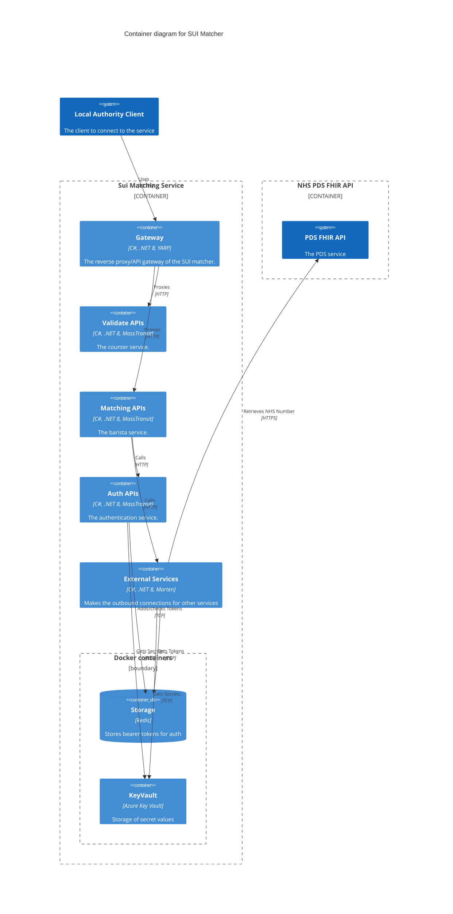
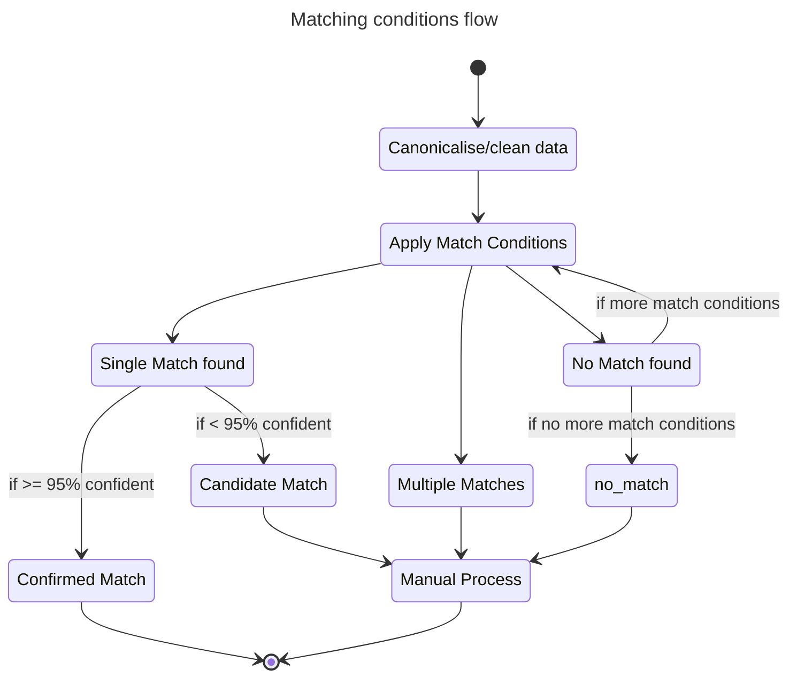

# Architecture

These are the architecture documents. 

## Constraints and Principals

This project is aimed at providing a solution for Local Authorities that require more accurate matching capabilities.

It requires a use-case to be agreed with NHS England to allow the use of the PDS FHIR API. This will require a number of governance steps to be followed, such as the [DTAC](https://transform.england.nhs.uk/key-tools-and-info/digital-technology-assessment-criteria-dtac/).

The PDS FHIR API has a limitation of 5TPS for requests, and the "fallback" logic used in the pilot means each match to a person may use >1 request. This means the PDS FHIR API is expected to initially be the biggest bottleneck for performance.

For principles, please refer to the [DfE Technical Guidance](https://technical-guidance.education.gov.uk/principles/general/) and [Secure by Design Principles](https://www.security.gov.uk/policy-and-guidance/secure-by-design/).

## Logical Architecture

Placeholder

## Application Architecture 

### Container diagram

### Services:

#### validate (external):

Endpoint used to validate data send to the endpoint. Will return information about the validatity of the data sent to it. Should validate for the following data items:

* given name (required)
* family name (required)
* gender
* postcode
* date of birth - which can be a range (required)
* email address
* phone number

Adapted from the schema specified here:
https://digital.nhs.uk/developer/api-catalogue/personal-demographics-service-fhir#get-/Patient

#### matching (external):

Supplied with the information also supplied to the validate endpoint. It controls the logic for matching a single record. It crafts the request parameters to pass to the external api service in order to make the outbound call to the NHS.

#### auth (internal):

Handles the secret key material in order to get the bearer token. It will maake its outbound connections via the external API. It will use azure keyvault to get the material needed to retrieve the bearer token. It will then store the bearer token in redis to be accessed by the external service.

NHS has [Examples of how to build](https://github.com/NHSDigital/hello-world-auth-examples/tree/main/application-restricted-signed-jwt-tutorials/csharp) on their git repo. 

#### external (internal):
Makes the external calls to the NHS authentication and NHS PDS endpoints. Will get secerts from keyvault and bearer token from Redis.

[Firely Client](https://docs.fire.ly/projects/Firely-NET-SDK/en/latest/client/setup.html) should be implemented using this library.

#### keyvault stub (local):
Currently a skeleton container in order to mimic azure keyvault in local testing. Unfortunately aspire does not provide an emulator for keyvault.

### Search Criteria

The search critera being used for the start of the pilot is as below, and is subject to change as real-world data and match rates are evaluated.

| Rule Order   | Search       | Example        | Returns       |
| :---         | :---         |     :---       |          :--- |
| 1 | fuzzy search with given name, family name and DOB. | `_fuzzy-match`=`true`, `family`=`harley`, `given`=`topper`, `birthdate`=`eq1960-06-09` | One of:   [NHS_NUM, NO_MATCH, POTENTIAL_MATCH, MANY_MATCHES] |
| 2 | fuzzy search with given name, family name and DOB range 6 months either side of given date. | `_fuzzy-match`=`true`, `family`=`harley`, `given`=`topper`, `birthdate`=`ge1960-01-09`&`birthdate`=`le1961-01-09` | One of:   [NHS_NUM, NO_MATCH, POTENTIAL_MATCH, MANY_MATCHES |
| 3 | fuzzy search with given name, family name and DOB. Given name and family name swapped. | `_fuzzy-match`=`true`, `family`=`topper`, `given`=`harley`, `birthdate`=`eq1960-06-09` | One of:   [NHS_NUM, NO_MATCH, POTENTIAL_MATCH, MANY_MATCHES |
| 4 | fuzzy search with given name, family name and DOB range 6 months either side of given date. Given name and family name swapped. | `_fuzzy-match`=`true`, `family`=`topper`, `given`=`harley`, `birthdate`=`ge1960-01-09`&`birthdate`=`le1961-01-09` | One of:   [NHS_NUM, NO_MATCH, POTENTIAL_MATCH, MANY_MATCHES |
| 5 | fuzzy search with given name, family name and DOB. Day swapped with month if day equal to or less than 12. | `_fuzzy-match`=`true`, `family`=`harley`, `given`=`topper`, `birthdate`=`eq1960-09-06` | One of:   [NHS_NUM, NO_MATCH, POTENTIAL_MATCH, MANY_MATCHES |

Definition of fuzzy search is defined here: [NHS FHIR API Search](https://digital.nhs.uk/developer/api-catalogue/personal-demographics-service-fhir#get-/Patient).

## Information Architecture

Placeholder

## Non Functional Requirements 

Placeholder

## Non Functional Priorities 

The Non-Functional Priorities for the pilot are listed below.

1. **Security** - Very sensitive data must be protected.
2. **Usability** - Easy for both internal teams and external partners (e.g., Local Authorities) to use and adopt.
3. **Compatibility** - Integration with existing systems like the NHS and Local Authority ecosystems.
4. **Maintainability** - Highly iterative development process anticipated.
5. **Reliability** - Not initially business-critical. Reliable enough for the pilot phase.
6. **Performance** - Handling relatively small workloads during the pilot phase.
7. **Availability** - Emphasis on maintenance and ensuring sufficient uptime.
8. **Portability** - Targeted at limited settings for the pilot.
9. **Scalability** - May scale from 1 to 4 Local Authorities (LAs) quickly, this would require these priorities to change. Future hosting patterns to be reviewed.
