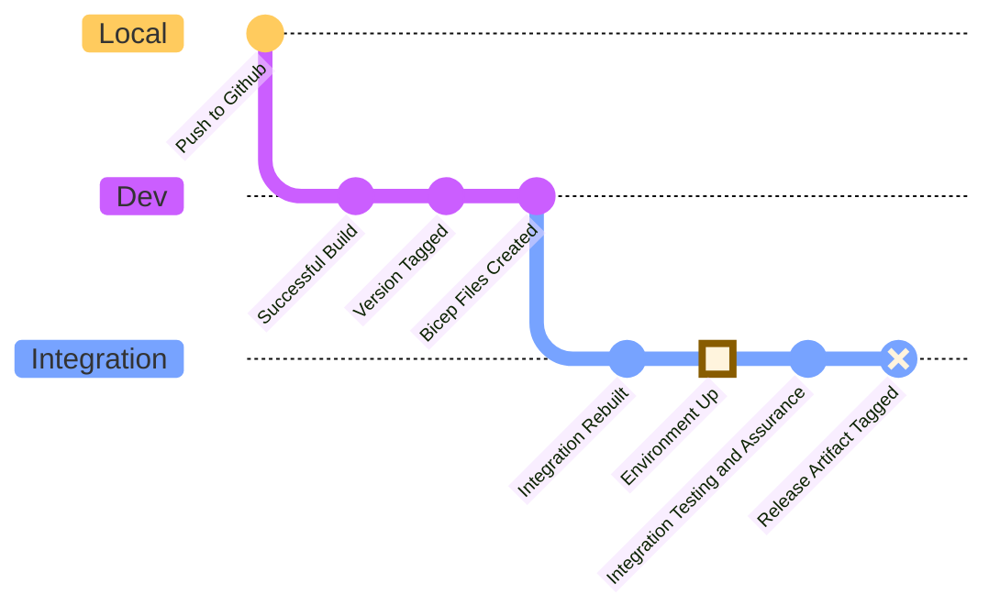

# CI/CD

## Environments

* Local
* Dev (pipeline)
* Integration
* Staging (local authority)
* Production (local authority)

**Local:**
Ability to spin up the environment and connect to the NHS integration environment in order to run integration tests or test the API for example returns.

**Dev:**
This referes to the environment that exists in our CI pipelines. All external dependencies should be stubbed out and no secret material needed.

**Integration:**
Static integration environment updated at every morning. Connects out to the NHS integration environment.

**Staging:**
Located within a local authority and allows for testing deployments before running in prod.

**Production:**
Live environment in prod running against real data.

## Environment Progression

There may be differences in how deployment is done in the different local authorities.

The below diagram looks at how environments are structured up until staging and production.

## Deployment

To be tested...
Looking at using bicep files output from the aspire framework and built using github actions. This will be the case for development. For staging and production we will potentially need a different way.

Currently, the deployment uses the saved bicep files to run the deployment. The bicep files are out of sync with what the aspire generator produces so currently if you need to add anything to the deployment it will have to be done manually.