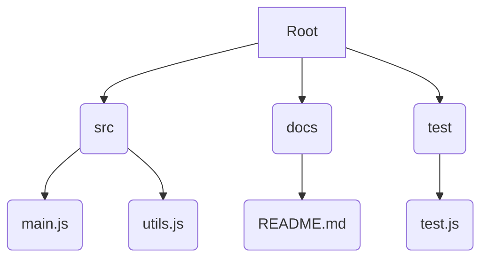

## Project File Structure

Here is an overview of the project structure:

```mermaid
graph TD;
A[Root] --> B(src);
A --> C(docs);
A --> D(test);
B --> E(main.js);
B --> F(utils.js);
C --> G(README.md);
D --> H(test.js);
```